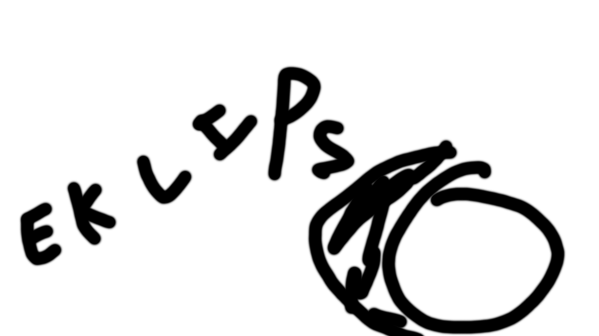

# Eclipse ~~Platform Project~~ *mieux*

*(official branding, do not @ me)*

Thanks for your interest in this project.

## How to Contribute

yea contribute whatever u want if it's good ill merge it dw

## Documentation

For additional documentation, please refer to the [docs directory](./docs) and [The Official Eclipse FAQs](./docs/FAQ/The_Official_Eclipse_FAQs.md).

## Issue Tracking

This project uses GitHub to track ongoing development and issues. In case you have an issue, please read the information about Eclipse being a [community project](https://github.com/eclipse-platform#community) and bear in mind that this project is almost entirely developed by volunteers. So the contributors may not be able to look into every reported issue. You will also find the information about [how to find and report issues](https://github.com/eclipse-platform#reporting-issues) in repositories of the `eclipse-platform` organization there. Be sure to search for existing issues before you create another one.

In case you want to report an issue that is specific to this `eclipse.platform` repository, you can [find existing issues](https://github.com/eclipse-platform/eclipse.platform/issues) or [create new issues](https://github.com/eclipse-platform/eclipse.platform/issues/new) within this repository.

## Contact

Contact the project developers via the project's "dev" list.

- <https://accounts.eclipse.org/mailing-list/platform-dev>

## License

[Eclipse Public License (EPL) 2.0](https://www.eclipse.org/legal/epl-2.0/)

## Art

